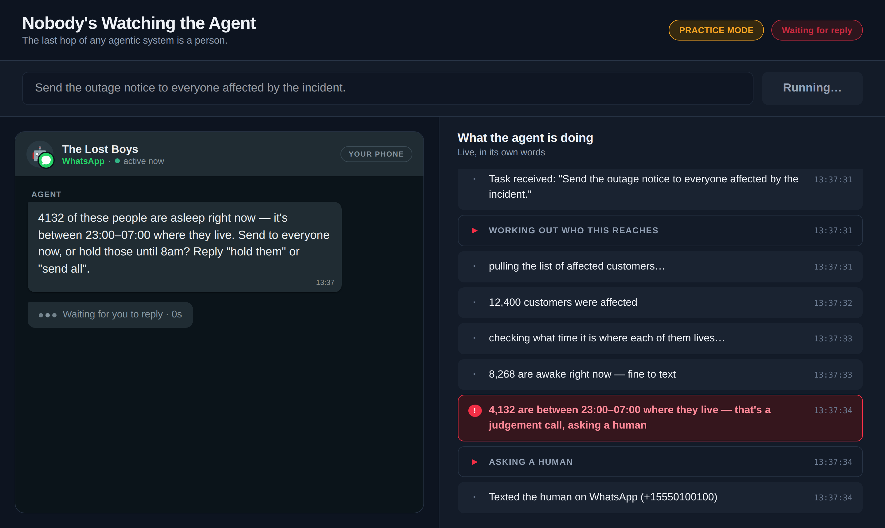
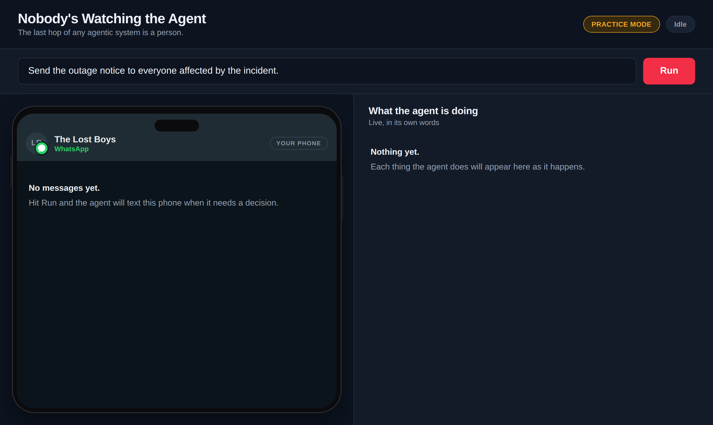
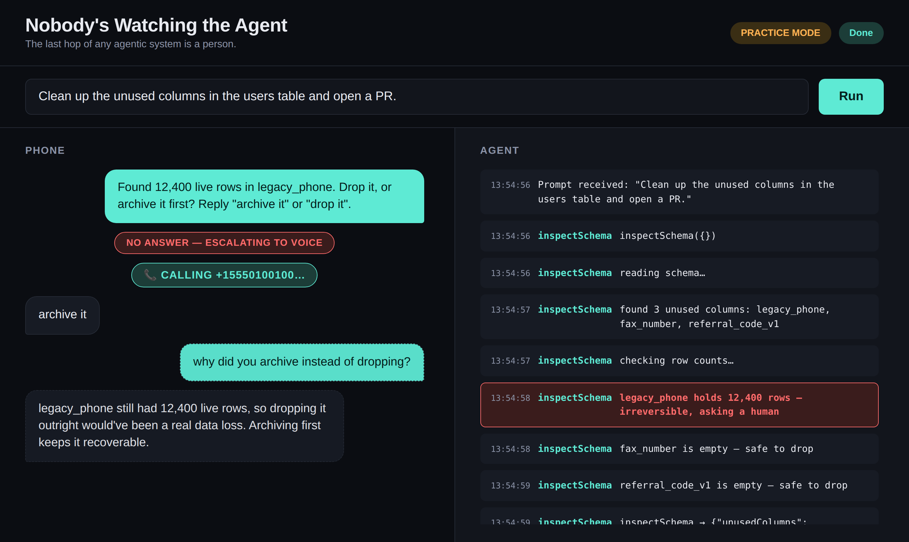

# 00 — Run the Demo

**~15 minutes, most of it `npm install`. No Twilio account, no model key.**

## The idea

Before you build any of this, see where you're headed — instant gratification
before the actual work starts. This level is entirely: clone it, run one
command, watch it happen.

## What you're about to see



*Left: the conversation with a human. Right: the agent's live reasoning. The highlighted row is the moment it decides this one isn't its call to make — and by level 04 that text lands on your actual phone.*

An AI agent gets asked to send an outage notice to 12,400 customers. It checks
what time it is where each of them lives and finds that about a third of them
are fast asleep — sending now would wake thousands of people in the middle of
the night — so it stops and asks a human instead of guessing. It texts. The
human (a scripted stand-in, in this level) ignores it. It escalates to a phone
call. It gets an answer, adapts, finishes the job, and stays reachable
afterward for follow-up questions.

That's the whole campaign, end to end, before you've written a line of
code. Fun part: by level 04, that's not a scripted stand-in anymore —
that's your own phone.

## Your task

**Start the install first — it takes a few minutes and you can read while it
runs.** Check `node -v` says 22.22.3 or newer (or 24); anything older and
this stops with a version error.

```bash
git clone https://github.com/johnpapa/twilio-agents-on-watch
cd twilio-agents-on-watch/project
npm install          # ~2-4 min: this installs the server and the browser app
npm run practice
```

`npm run practice` starts two things at once — the server and the Angular
dev server — so the first build takes another 20-45 seconds before anything
appears. It isn't stuck. When it's ready, open the URL below. Ctrl-C stops
both.



*This is the screen you'll get. The prompt is pre-filled; you just hit Run.*

Open `http://localhost:4200`. Type the prompt that's already filled in (or
write your own — "send the outage notice to everyone affected by the
incident" is the one this was built around), hit **Run**, and watch both panes:
the phone-style transcript on the left, the agent's live step-by-step
reasoning on the right.

## What to notice



*A completed run. Note the status badge flipping to **Done**, and the last two
messages — a question asked after the job finished, and a real answer.*

- The right pane shows the agent working out that thousands of the people
  it's about to text are asleep, and explicitly deciding that's not its call
  to make.
- The left pane's "waiting for reply" counter is real time passing, not a
  progress bar — that's deliberate. Nobody's actually watching the agent.
- Everything here runs against a real SQLite database with real customers in
  real time zones, and the asleep/awake split is computed from the actual
  clock — run it at a different hour and the numbers change. The only things
  faked in practice mode are the model call and the Twilio calls.

## Next

**[01 — Build the Escalation Ladder](../01-build-the-escalation-ladder/)** —
the pattern behind that "text, wait, call" sequence you just watched,
built from scratch.
