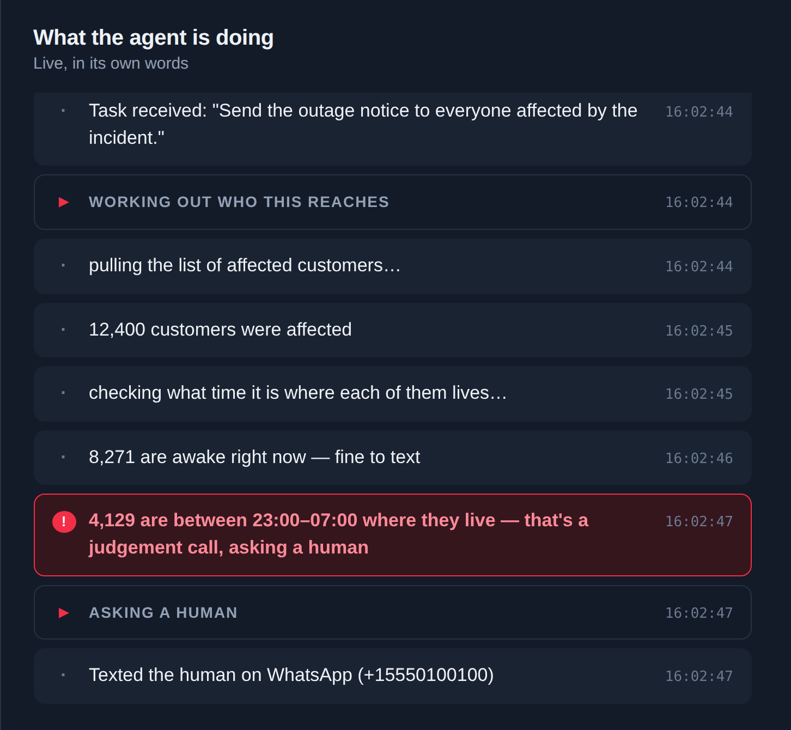

# 01 — Build the Escalation Ladder

**~20 minutes. No Twilio account, no npm install — plain Node.js.**

## The idea



*This is what you're building the logic behind. 12,400 people to notify, about 4,000 of them fast asleep — and a hard stop instead of a guess. No Twilio yet in this level; just the pattern.*

Think about what a good assistant does when they hit something above their
pay grade: they don't guess, and they don't sit on it forever either. They
ask — first quietly (a text), then more insistently if nobody answers (a
call) — and they keep the original question in mind the whole time, however
they finally get an answer.

That's the whole pattern this level builds: **text, wait, escalate to a
call if ignored, keep waiting, return whatever the human decided.** Every
later level is about making one piece of this real. This level is about
getting the shape of it right first, with nothing that can flake — no
network, no account, no timing surprises.

## What's here

- `starter/fakeChannel.js` — a stand-in for Twilio. `sendText()`,
  `checkForReply()`, and `placeCall()`, all fake, all instant. Don't edit
  this file.
- `starter/askHuman.js` — the function you're building. Three `TODO`s.
- `starter/run.js` — runs `askHuman()` against three scripted scenarios.

## Your task

Open `starter/askHuman.js` and fill in the three `TODO`s. Read the comments
above each one — they tell you exactly what to build.

What you're writing, twice, is a **polling loop**: ask "any reply yet?", wait
a moment, ask again, and give up after a set time. There's no magic here and
no framework — it's a `while` loop with a clock. Once before the call goes
out, once after.

## Verify it

```bash
cd starter
node run.js quick-reply   # human replies before the call -- no call happens
node run.js ignored       # human ignores the text, replies after the call
node run.js never         # human never replies -- askHuman() should throw
```

Expected output:

```
--- scenario: quick-reply ---
[text sent]    "4,000 of these people are asleep right now. Send to everyone now, or hold those until 8am?"

Final decision: "hold them"
```

```
--- scenario: ignored ---
[text sent]    "..."
[calling...]   "..."

Final decision: "hold them"
```

```
--- scenario: never ---
[text sent]    "..."
[calling...]   "..."

Threw as expected: No human response received after voice escalation.
```

If `ignored` doesn't show `[calling...]`, or `never` doesn't throw, you've
got a bug in the escalation logic, not the fake channel — it's deliberately
too simple to be the problem.

All three passing means you just built the exact pattern the real agent
uses, with none of the parts that could get in the way of understanding it.
Nice.

Stuck? `solution/` has a working version. Diff it against yours rather than
just reading it.

## If you handed this level to an agent instead

The task is scoped tightly on purpose: "fill in these three TODOs in this
file, verify with these three commands, expect this output." That's exactly
the shape a coding agent handles well — concrete, bounded, verifiable. If
you're running this with Claude Code or another coding agent, this level
is a reasonable one to just hand over and watch: *"Fill in the three TODOs
in `starter/askHuman.js`, then run all three scenarios in `starter/run.js`
and confirm the output matches what's described in this level's README."*

## Next

**[02 — Send and Receive Real Texts](../02-send-and-receive-real-texts/)** —
same pattern, real Twilio, a real message on your real phone.
