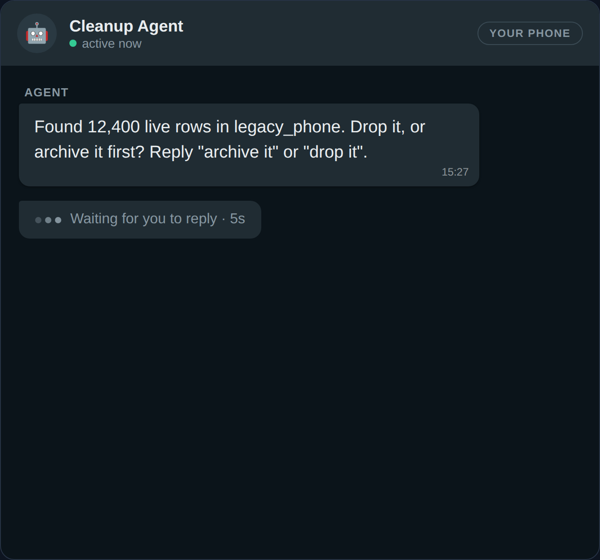

# 02 — Send and Receive Real Texts

**~25 minutes, including signing up. Free Twilio account, your phone. This is
the only level that sends you to the Twilio Console.**

## The idea



*That counter is real time passing. By the end of this level the message on the left is on your phone, sent by code you wrote.*

Level 01 built the pattern with a fake channel. This is the fun part where
that stops being pretend: an actual message, on your actual phone, with no
multi-day approval wait in the way. That last part isn't free — US SMS over
a normal phone number requires carrier registration (A2P 10DLC) that can
take anywhere from minutes to over a week to approve, which would turn this
level into "come back next week." Texting here runs over the **Twilio
WhatsApp Sandbox** instead: real messages, free, working in the next ten
minutes. [Going further](../05-going-further/) covers what changes for a
production-grade SMS or WhatsApp Business sender.

## Setup

1. **Twilio account.** Sign up at twilio.com. On the Console home page,
   copy your **Account SID** (starts `AC`).
2. **API Key.** Console → Account → API keys & tokens → Create API key.
   Copy the SID (starts `SK`) and the Secret — the secret is shown once.
   (This project always uses an API Key + Secret, never the Auth Token —
   the Auth Token is a root credential for the whole account; an API Key
   can be revoked on its own. See `project/AGENTS.md` for why this mattered
   enough to check against Twilio's own guidance.)
3. **Join the WhatsApp Sandbox.** In the Console, find Messaging → Try it
   out → Send a WhatsApp message. It'll show a sandbox number and a join
   code like `join happy-elephant`. From your own phone, text that exact
   phrase to that number. You'll get a confirmation reply. This join lasts
   **72 hours** — rejoin if it's been a few days.
4. **Claim your free phone number, while you're already here.** You don't
   need it until level 03, but you're in the Console now and going back
   later costs you a second round of hunting through menus. Console → Phone
   Numbers → Manage → Active Numbers. Every trial account comes with one at
   no charge, so there may already be one sitting there. If not: Phone
   Numbers → Buy a Number, make sure **Voice** is checked, and claim one —
   trial credit covers it. Copy it in E.164 format. *(On a paid account
   instead? A voice-capable number is about $1/month, bought the same way.)*
5. **Configure.** In `project/`, `cp .env.example .env` and fill in
   `TWILIO_ACCOUNT_SID`, `TWILIO_API_KEY_SID`, `TWILIO_API_KEY_SECRET`,
   `PRESENTER_PHONE_NUMBER` (your own number, the one you joined with,
   E.164 format like `+15551234567`), and `TWILIO_VOICE_NUMBER` (the one you
   just claimed). That's every credential the whole campaign needs except
   the model key in level 04 — you won't be sent back to the Console again.

## Your task

Create the scripts folder and a file in it — the folder doesn't exist yet:

```bash
mkdir -p project/server/src/scripts
```

`project/server/src/scripts/hello-whatsapp.ts`:

```ts
import 'dotenv/config';
import { sendMessage } from '../twilio/messaging.js';
import { PRESENTER_NUMBER } from '../twilio/client.js';

const sid = await sendMessage(PRESENTER_NUMBER(), 'Hello from a script, not a demo.');
console.log(`Sent, sid=${sid}. Check your phone.`);
```

Run it from `project/server`:

```bash
npx tsx src/scripts/hello-whatsapp.ts
```

You should get a real WhatsApp message within a few seconds. That's a
message your own code sent, over infrastructure Twilio runs, landing on a
phone in your actual hand. First time always feels like it shouldn't have
been that easy.

## Verify it

```bash
cd project
npm run preflight
```

This is the same check the live demo runs before going on stage — it sends
a real message and polls the message resource's actual delivery `status`,
not just the HTTP response code (a `201` from Twilio proves the request was
accepted, not that anything arrived). Run this any time you're not sure the
sandbox connection is still good.

## What to notice

Open `project/server/src/twilio/messaging.ts`. `sendMessage()` and
`listInboundSince()` both add a `whatsapp:` prefix to every number — that
one prefix is the entire difference between this code sending SMS and
sending WhatsApp. `listInboundSince()` is also how the rest of this app
"receives" texts: it polls Twilio's message list rather than waiting on a
webhook. [Level 04](../04-stay-reachable-after-the-call/) is where that
polling pattern gets reused for something more interesting than one script.

## If you handed this level to an agent instead

The account-setup steps (1-4) need you personally — an agent can't join a
WhatsApp Sandbox on your behalf. Once `.env` is filled in, the rest is
agent-shaped: *"Create `hello-whatsapp.ts` per this level, run it, then
run `npm run preflight` and confirm it reports PASS."*

## Next

**[03 — Place a Real Call](../03-place-a-real-call/)** — same account, a
real phone ringing.
