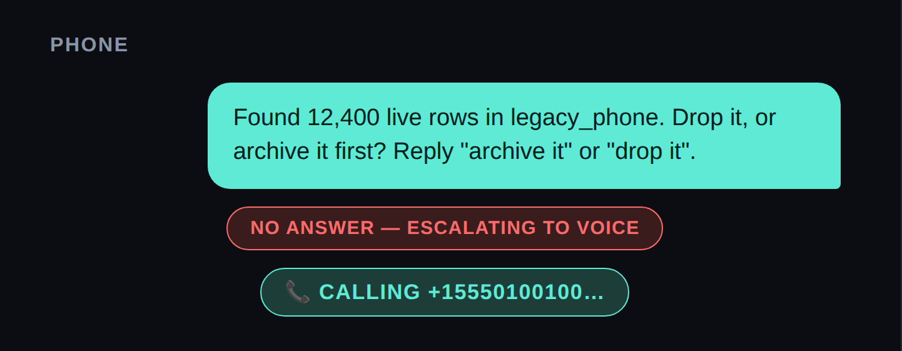

# 03 — Place a Real Call

### 👑 Boss level

**~10 minutes. No setup — you claimed everything in level 02.**

## The idea



*The best fifteen seconds in the whole campaign: the text gets no reply, and your pocket starts buzzing. A voice you didn't record reads out a question your code wrote.*

A text that gets no reply tells you almost nothing — the agent can't tell
"still thinking" apart from "never saw it." So it tries a different channel.
Not a louder one; a different one, on a different network, that says the
problem out loud instead of waiting to be read.

This is the best level: your phone actually rings, and a genuinely
good-sounding voice actually speaks the question. Code you wrote made your
pocket buzz. Small thrill, every time.

## Setup

None. You claimed the number and put it in `.env` as `TWILIO_VOICE_NUMBER`
back in level 02, so this level is code from the first line. (If you skipped
that step, it's step 4 of level 02 — go and grab it now.)

One thing worth knowing before you run anything: **Twilio trial accounts can
only call numbers you've verified.** The number you verified when you signed
up is already good, so if `PRESENTER_PHONE_NUMBER` is that number you're
fine. If it isn't, the call fails with an unverified-caller-ID error — add it
under Console → Phone Numbers → Verified Caller IDs. This can't bite you
earlier, because joining the WhatsApp Sandbox in level 02 doesn't care about
caller-ID verification at all.

**Why two numbers?** Because these are two different networks. Your texts go
over WhatsApp — that's the internet. This call goes over the phone network,
the same one a call from your mum uses. Twilio *does* offer WhatsApp voice
calling, but it needs a business-verified sender and the recipient's advance
permission, and it can't reach ordinary phone numbers at all. Two channels on
two networks is the whole point of the escalation: if one doesn't reach a
human, the other one might.

## Your task

Create `project/server/src/scripts/hello-call.ts`:

```ts
import '../env.js';
import { placeEscalationCall } from '../twilio/voice.js';
import { PRESENTER_NUMBER } from '../twilio/client.js';

const sid = await placeEscalationCall(
  PRESENTER_NUMBER(),
  'This is a test call from a script you wrote yourself.',
);
console.log(`Call placed, sid=${sid}. Pick up.`);
```

Run it from `project/server`:

```bash
npx tsx src/scripts/hello-call.ts
```

Your phone should ring within a few seconds.

## What to notice

Open `project/server/src/twilio/voice.ts`. The whole call is one API call —
`client.calls.create({ to, from, twiml })` — with the spoken script handed
in directly as inline XML (TwiML), not a URL to a page that generates it.
That's deliberate: nothing to host, nothing that needs a public server just
to say a sentence out loud.

Read the comment above `placeEscalationCall()`. It's not just a note about
character limits — it's there because Twilio's own guidance for outbound
calls is explicit: confirm intent before calling, and respect the
recipient's local time — calls are only permitted between 8am and 9pm where
they are, not where you are. This demo calls one pre-confirmed
number (you), so that's fine here. It would not be fine in anything that
calls people who didn't sign up for it — that's a real product requirement,
not a nice-to-have, and it's worth internalizing now rather than after
you've shipped something that ignores it.

## Verify it

Your phone rang and a voice read out your sentence. That's it — both
channels are real now, and level 04 is where they finally run together.
(No need to re-run level 02's script; you watched it work ten minutes ago.)

## If you handed this level to an agent instead

All of it is agent-shaped now that the Console work is behind you —
*"Create `hello-call.ts` per this level, run it, and confirm the call sid
is returned."* An agent can't confirm the phone actually rang, though;
that part's still on you, and it's the good part.

## Next

**[04 — Stay Reachable After the Call](../04-stay-reachable-after-the-call/)**
— the part that makes this feel less like a script and more like something
that's actually listening.
