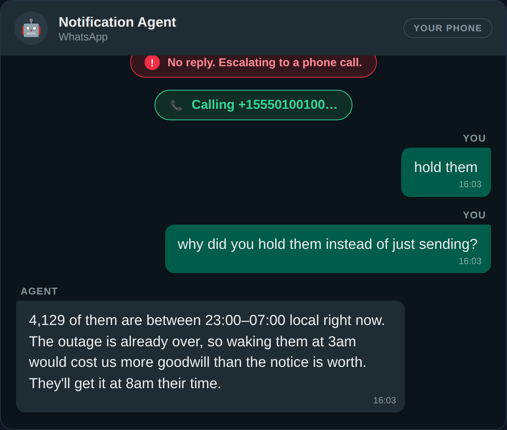

# 04 — Stay Reachable After the Call

**~15-20 minutes. Everything from levels 00-03, running together.**

## The idea



*The whole escalation, start to finish — and then the part most demos skip. You text it a question afterwards and it answers, because it's still there.*

Every level so far has been one channel at a time, mostly through small
scripts. This level is the first time you run the whole thing together —
and it adds the part that makes this feel less like a demo and more like
something actually listening: after the call ends, the number stays live.
Anyone who texts it gets a real answer about what just happened, not a dead
end.

## Setup

You need one more value in `.env`: `ANTHROPIC_API_KEY` (this is the first
level that runs the actual agent loop, not a standalone script — see the
repo root README for where to get one). `GITHUB_TOKEN` and `GITHUB_PR_REPO`
are optional; leave them blank and the agent still runs for real, it just
skips opening a PR and says so.

## Your task

```bash
cd project
npm start
```

Open `http://localhost:4200`, hit Run, and play the whole thing out for
real: ignore the text, let it ring, answer with "hold them," watch it
finish. Then — this is the actual point of the level, so don't skip it —
**from your phone, send a new WhatsApp message to the same sandbox number**,
something like *"why did you hold them instead of just sending?"* You should get
a real, specific answer back within a few seconds, grounded in what the
agent actually did, not a canned response. That's the moment this whole
campaign has been building toward — text something you built out of the
blue, hours after it finished, and it just answers you.

## What to notice

Open `project/server/src/reachable.ts`. This is a background loop, separate
from the request that started your run — it polls for *any* new inbound
message to the sandbox number, not just an expected reply, and routes each
one to the agent with the last run's summary as context. `handledSids`
exists so the same message never gets answered twice if the poller happens
to see it more than once.

This is the same polling idea from level 02's `listInboundSince`, reused
for a different job: level 02 waited for one specific expected reply and
gave up after a timeout; this waits indefinitely for messages from anyone.

## Stretch goal (optional)

The repo root README's "known weak points" section says this out loud:
**there's no auth on who can text this number and get an answer.** Anyone
who's joined the WhatsApp Sandbox can ask it questions and get real replies
using your API spend.

If you want to push further: add a simple allowlist to `reachable.ts` — a
short list of numbers (env var, comma-separated) that are allowed to
trigger a reply; anyone else's message gets logged and ignored. This is a
real production concern, not a made-up exercise — you're not done with this
campaign until you've thought about who else can talk to the thing you
built.

## If you handed this level to an agent instead

The live "ignore the text, answer the call" moment needs you — an agent can't
answer a phone call for you. The closing-text verification and the stretch
goal are both agent-shaped: *"After a real run completes, send a follow-up
WhatsApp message and confirm a relevant reply arrives"* and *"Add a
comma-separated allowlist env var to `reachable.ts` that only replies to
listed numbers"* are both concrete enough to hand over.

## You're done — seriously, nice work

`npm run practice` plays the whole thing with no credentials. `npm start` does
it for real: a text arrives and gets ignored, a phone rings, a voice states
the problem, a reply comes back, the agent finishes the job — and it's
still listening afterward. That's the whole campaign, and it's yours now.
Text some friends the sandbox number and let them poke at it — that's the
fun part of building something that talks back.

Run `npm run status` from `project/` for your scorecard. All five green
means 🏆 GAME COMPLETE.

Want to see what changes for a real product instead of a demo? →
**[05 — Going Further](../05-going-further/)**
